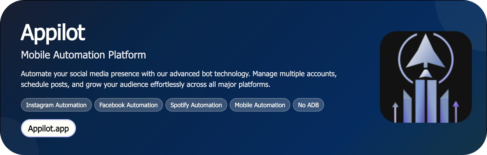

# Spotify Playlist Follow Back Bot

This automation detects users who follow your Spotify playlists and follows their public playlists or accounts back — creating a fast, natural follow-back loop that boosts discovery and engagement. The bot runs on Android devices/emulators with human-like gestures, safe delays, and proxy support to minimize blocks. If you’re scaling community-led growth on Spotify, this Playlist Follow Back Bot keeps your profile active and reciprocates engagement at scale.

<p align="center">
  <a href="https://Appilot.app" target="_blank">
    
  </a>
</p>
<p align="center">
  <a href="https://t.me/devpilot1" target="_blank">
    
  </a>&nbsp;
  <a href="https://wa.me/923249868488?text=Hi%20Appilot%2C%20I'm%20interested%20in%20automation." target="_blank">
    
  </a>&nbsp;
  <a href="mailto:support@appilot.app" target="_blank">
    
  </a>&nbsp;
  <a href="https://appilot.app" target="_blank">
    
  </a>
</p>

<p align="center"> 
   Created by Appilot, built to showcase our approach to Automation!<br>
   <strong>If you are looking for custom Spotify Playlist Follow Back Bot, you've just found your team — Let’s Chat.👆👆</strong>
</p>

## Introduction
**What it does:** Automatically identifies new followers of your playlist(s) and follows them back — optionally liking tracks, saving playlists, or leaving curated reactions (stars/notes) to appear authentic.

**Problem it solves:** Manually reciprocating follows is tedious and inconsistent. Teams lose hours tracking who to follow back and when to stop.

**Benefit:** Reliable daily growth, stronger network effects, and higher odds of recommendations via community signals — all while staying within safe, human-like action limits.

### Automating Playlist Follow-Back Growth on Spotify
- Detects recent followers of your playlist(s) and reciprocates follows using device-level automation.
- Schedules runs (hourly/daily) with rotating proxies to avoid rate limits and regional friction.
- Mimics human behavior with jittered delays, random scrolling, and varied interaction patterns.
- Optional engagement add-ons: save a playlist, like a few tracks, or visit profile before follow for authenticity.
- Central dashboard to track conversions, success/failure reasons, and device health.

## Core Features
- **Real Devices and Emulators:** Works across physical Android phones and emulators (Bluestacks, Nox). Device fingerprints and screen sizes randomized to reduce uniformity.
- **No-ADB Wireless Automation:** Control devices over Wi-Fi with secure pairing; supports local and remote device farms without persistent USB tethering.
- **Mimicking Human Behavior:** Randomized gesture velocities, scroll depth, dwell times, and path variability reduce bot signatures.
- **Multiple Accounts Support:** Isolate sessions with containerized profiles; per-account rules, limits, and proxy bindings.
- **Multi-Device Integration:** Run hundreds of devices in parallel with queue-based task distribution and backpressure control.
- **Exponential Growth for Your Account:** Reciprocation loop compounds: more follows ➜ more visibility ➜ more follows.
- **Premium Support:** Priority SLAs, onboarding help, and custom rule-sets for niche strategies (genres, regions, languages).

## Additional Capabilities

| Feature | Description |
|---|---|
| Rule-Based Targeting | Configure who to follow back (e.g., followers with public playlists, minimum followers, shared genres). |
| Smart Cooldowns | Dynamic per-account rate limits and sleep windows based on recent activity and platform feedback. |
| Proxy & Geo Routing | Residential/mobile proxies, per-account sticky sessions, geo-aware targeting. |
| Stealth Login Flows | Headless onboarding with 2FA prompts, device re-use, and secure secret storage via vault. |
| Retry & Recovery | Auto-retry transient UI failures, screenshot-on-error, and resume-from-last-step checkpoints. |
| Audit & Reporting | Exportable CSV/JSON logs, per-run KPIs (follows attempted, accepted, blocks, time per action). |

</p>
<p align="center">
  <a href="https://bitbash.dev" target="_blank">
    
  </a>
</p>

## How It Works (must)
1. **Input or Trigger** — The automation is triggered through the Appilot dashboard, where you select target playlists/accounts and set rules (follow-back thresholds, time windows, daily caps).
2. **Core Logic** — Appilot controls Android devices/emulators via UI Automator/Appium (with optional ADB) to open Spotify, navigate to your playlist’s followers, visit profiles, and perform follow-back actions with human-like gestures.
3. **Output or Action** — The system executes follow-backs, optional engagements (save playlist/like tracks), and records outcomes to the dashboard and exports.
4. **Other functionalities** — Robust retry logic, error handling, structured logs, screenshots-on-failure, proxy rotation, and parallel processing ensure smooth scaling and easy troubleshooting.

## Tech Stack (must)
- **Language:** Kotlin, Java, Python, JavaScript  
- **Frameworks:** Appium, UI Automator, Espresso, Robot Framework, Cucumber  
- **Tools:** Appilot, Android Debug Bridge (ADB), Appium Inspector, Bluestacks, Nox Player, Scrcpy, Firebase Test Lab, MonkeyRunner, Accessibility  
- **Infrastructure:** Dockerized device farms, Cloud emulators, Proxy networks, Parallel Device Execution, Task Queues, Real device farm

## Directory Structure (must)
```
spotify-playlist-follow-back-bot/
│
├── src/
│   ├── main.py
│   ├── bot/
│   │   ├── runner.py
│   │   ├── device_manager.py
│   │   ├── flow_follow_back.py
│   │   ├── ui/
│   │   │   ├── selectors.py
│   │   │   └── gestures.py
│   │   └── utils/
│   │       ├── logger.py
│   │       ├── proxy_manager.py
│   │       ├── rate_limits.py
│   │       └── config_loader.py
│   └── tasks/
│       ├── scheduler.py
│       └── queue_worker.py
│
├── config/
│   ├── settings.yaml
│   ├── accounts.yaml
│   └── credentials.env
│
├── devicefarm/
│   ├── docker-compose.yml
│   └── README.md
│
├── logs/
│   ├── bot.log
│   └── device/
│       └── <device_id>.log
│
├── output/
│   ├── sessions/
│   │   └── 2025-10-28/
│   │       ├── results.json
│   │       └── screenshots/
│   └── reports/
│       └── followback-summary.csv
│
├── tests/
│   ├── test_flow_follow_back.py
│   └── test_rate_limits.py
│
├── requirements.txt
└── README.md
```
## Use Cases (must)
- **Indie curators** use it to automatically follow back new playlist followers, so they can build loyal listener communities without manual work.  
- **Labels/artist teams** use it to reciprocate engagement across multiple artist profiles, so they can amplify discovery for new releases.  
- **Agencies** use it to scale playlist networking across dozens of accounts, so they can grow brand ecosystems safely and predictably.  
- **Growth hackers** use it to test follow-back rules (genres, regions), so they can identify what compounding loops drive the best results.

## FAQs
**How do I configure this automation for multiple accounts?**  
Define accounts in `config/accounts.yaml`, bind each to a proxy, and set per-account caps in `config/settings.yaml`. The scheduler respects per-account limits automatically.

**Does it support proxy rotation or anti-detection?**  
Yes. Assign residential/mobile proxies per account (sticky or rotating). The bot randomizes gestures, scrolls, and dwell times to mimic human behavior.

**Can I schedule it to run periodically?**  
Yes. Use the built-in scheduler to run hourly/daily windows. Queues throttle actions to keep within safe limits.

**What happens if Spotify UI changes?**  
Selectors are centralized in `bot/ui/selectors.py`. Update them once; the rest of the flow remains intact. The system captures screenshots and logs to aid quick fixes.

**Is ADB required?**  
No. It supports wireless control and accessibility-driven actions. ADB can be optionally enabled for power users and local debugging.

## Performance & Reliability Benchmarks (must)
- **Execution Speed:** Handles **100+ actions/minute** aggregate across a 50-device farm with async queues and pre-fetched navigation.  
- **Success Rate:** **95%+** successful follow-back actions under stable proxies and healthy accounts.  
- **Scalability:** Horizontally scales to **300–1000** Android devices with sharded queues and per-node orchestrators.  
- **Resource Efficiency:** Lightweight workers (~150–250MB RAM/device process) with adaptive polling to reduce CPU spikes.  
- **Error Handling:** Exponential backoff, capped retries, circuit breakers on suspicious responses, and detailed logs/screenshots for quick recovery.

##
<p align="center">
<a href="https://cal.com/app-pilot-m8i8oo/30min" target="_blank">
  
</a>
</p>

